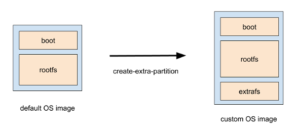

# raspi-basecamp

Collection of tools for customizing Raspberry PI (Raspbian).


## Menu

### create-extra-partition

Command to add extrafs partition to Raspbian OS image file.
This requires `kpartx`.



```
$ sudo bin/create-extra-partition path/to/YYYY-MM-DD-raspbian-stretch-lite.img
```

### expand-extrafs

Expand the `extrafs` partition created by [create-extra-partition](../bin/create-extra-partition) to the maximum size of the SD card. See [detail](./expand-extrafs/README.md).


### export-compact-os-image

Command to export os image file.


```
$ sudo bin/export-compact-os-image path/to/sdcard path/to/export.img
```

### readonlyfs

readonlyfs makes the root file system read-only using overlayfs. See [detail](./readonlyfs/README.md).

### swap-extra-path

Move the "rootfs" partition file to the "extrafs" partition and replace it with a symbolic link.

This command needs to be executed on Raspbian OS.


```
$ sudo bin/swap-extra-path path/to/file
```
